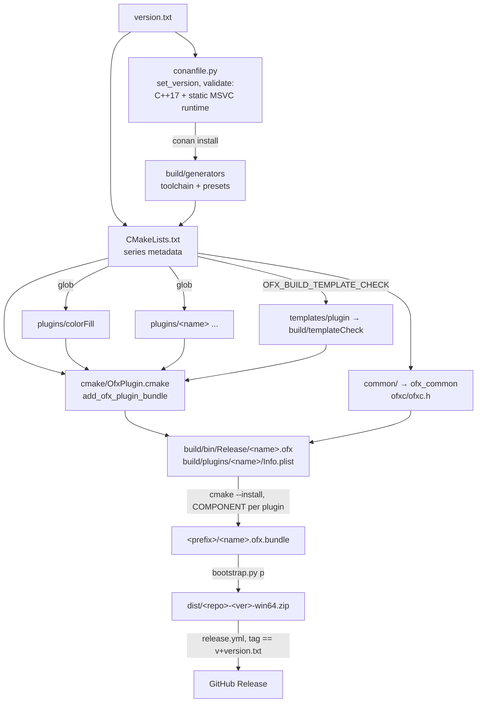
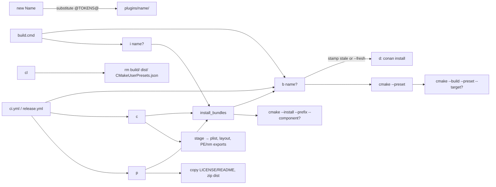
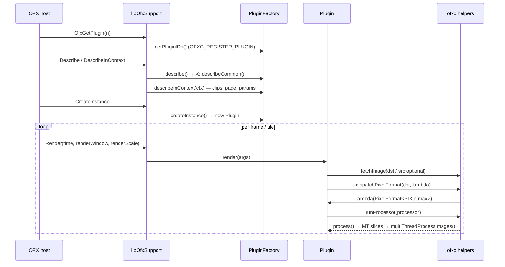

# Diagrams

## Repository & build graph

```mermaid
flowchart TD
    V[version.txt] --> CF[conanfile.py<br/>set_version, validate:<br/>C++17 + static MSVC runtime]
    V --> ROOT[CMakeLists.txt<br/>series metadata]
    CF -->|conan install| GEN[build/generators<br/>toolchain + presets]
    GEN --> ROOT
    ROOT --> OP[cmake/OfxPlugin.cmake<br/>add_ofx_plugin_bundle]
    ROOT --> COM[common/ → ofx_common<br/>ofxc/ofxc.h]
    ROOT -->|glob| P1[plugins/colorFill]
    ROOT -->|glob| PN[plugins/&lt;name&gt; ...]
    ROOT -->|OFX_BUILD_TEMPLATE_CHECK| TC[templates/plugin → build/templateCheck]
    P1 --> OP
    PN --> OP
    TC --> OP
    OP --> BIN[build/bin/Release/&lt;name&gt;.ofx<br/>build/plugins/&lt;name&gt;/Info.plist]
    COM --> BIN
    BIN -->|cmake --install, COMPONENT per plugin| B[&lt;prefix&gt;/&lt;name&gt;.ofx.bundle]
    B -->|bootstrap.py p| Z[dist/&lt;repo&gt;-&lt;ver&gt;-win64.zip]
    Z -->|release.yml, tag == v+version.txt| GH[GitHub Release]
```

## bootstrap.py commands

```mermaid
flowchart LR
    new[new Name] -->|substitute @TOKENS@| tpl[plugins/name/]
    b[b name?] -->|stamp stale or --fresh| d[d: conan install]
    b --> cfg[cmake --preset] --> bld[cmake --build --preset --target?]
    i[i name?] --> ib[install_bundles]
    p[p] --> ib
    c[c] --> ib
    ib --> b
    ib --> inst[cmake --install --prefix --component?]
    p --> zip[copy LICENSE/README, zip dist]
    c --> chk[stage → plist, layout, PE/nm exports]
    cl[cl] --> rm[rm build/ dist/ CMakeUserPresets.json]
    cmd[build.cmd] --> b
    cmd --> i
    ci[ci.yml / release.yml] --> b
    ci --> c
    ci --> p
```

## Host ↔ plugin action sequence (any plugin)

```mermaid
sequenceDiagram
    participant H as OFX host
    participant S as libOfxSupport
    participant F as PluginFactory
    participant P as Plugin
    participant X as ofxc helpers
    H->>S: OfxGetPlugin(n)
    S->>F: getPluginIDs() (OFXC_REGISTER_PLUGIN)
    H->>S: Describe / DescribeInContext
    S->>F: describe() → X: describeCommon()
    S->>F: describeInContext(ctx) — clips, page, params
    H->>S: CreateInstance
    S->>F: createInstance() → new Plugin
    loop per frame / tile
        H->>S: Render(time, renderWindow, renderScale)
        S->>P: render(args)
        P->>X: fetchImage(dst / src optional)
        P->>X: dispatchPixelFormat(dst, lambda)
        X->>P: lambda(PixelFormat<PIX,n,max>)
        P->>X: runProcessor(processor)
        X-->>P: process() → MT slices → multiThreadProcessImages()
    end
```
