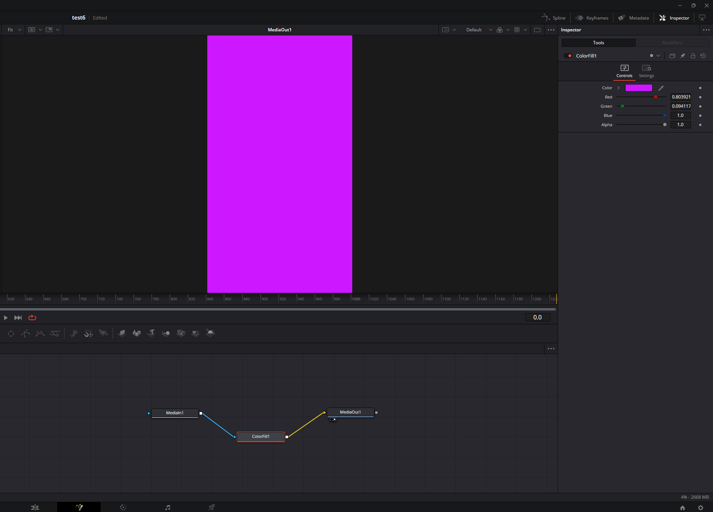

# OpenFX Plugin Series Template

[](https://github.com/ssoj13/boilerplate_openfx/actions/workflows/ci.yml)
[](LICENSE)
[](https://conan.io/)
[](https://openeffects.org/)
[](https://en.cppreference.com/w/cpp/17)

**A production-ready starting point for writing a whole series of OpenFX plugins** for DaVinci Resolve,
Nuke, Natron, Flame, Vegas and other OFX hosts.

Scaffold a new plugin with one command, build and verify all of them with another, and ship a
zipped release from a git tag. The OpenFX SDK comes from Conan, so there are no submodules to
vendor and no SDK to build by hand.



## Why

Writing the first OpenFX plugin is mostly fighting everything *around* the image processing:
getting the SDK built, laying out the `.ofx.bundle` correctly, supporting 8/16/32-bit images
without corrupting memory, respecting tiles and render windows, threading, and packaging for
release. Doing it again for the second plugin is worse, because now it gets copy-pasted.

This template does that work once, for every plugin in the repo:

- **One command per plugin**: `python bootstrap.py new MyGlow`. It generates a working filter
  that CMake finds automatically.
- **Shared, tested plumbing**: pixel-format dispatch, image validation, multi-threaded processing
  and plugin registration live in one header (`ofxc`), not in every plugin.
- **Correct by construction**: pixels are only accessed through `getPixelAddress()`; every declared
  bit depth and component layout gets its own template instantiation; the filter context gets its
  mandatory `Source` clip; bundles follow the OFX packaging spec.
- **Self-contained binaries**: the MSVC runtime is linked statically, so each `.ofx` depends only on
  `KERNEL32.dll` and can't clash with whatever `msvcp140.dll` the host has already loaded.
- **Verified output**: `bootstrap.py c` installs every bundle into a staging folder and checks
  `Info.plist`, the folder layout and the exported OFX entry points. CI runs the same check.

## Quick start

**Requirements:** Python 3.8+, CMake 3.23+, Visual Studio 2022+, Conan 2 *or* [uv](https://docs.astral.sh/uv/)
(if `conan` isn't on `PATH`, `bootstrap.py` runs it through `uvx conan`).

```sh
git clone https://github.com/ssoj13/boilerplate_openfx.git
cd boilerplate_openfx
python bootstrap.py b      # conan install + configure + build all plugins
python bootstrap.py c      # verify every bundle
python bootstrap.py i      # install into C:\Program Files\Common Files\OFX\Plugins\Joss_examples (admin)
```

Restart the host. The plugins appear in the `Joss_examples` group.

## Your own plugin in a minute

```sh
python bootstrap.py new MyGlow --id com.yourcompany.MyGlow --label "My Glow"
python bootstrap.py b myGlow
python bootstrap.py i myGlow --prefix ./my-plugins
```

`plugins/myGlow/` now holds a working **Gain** filter: a `Source` input, a parameter page, an
`isIdentity` shortcut, and a multi-threaded processor for 8/16/32-bit RGBA and Alpha. Replace the
per-pixel code with your algorithm:

```cpp
void render(const OFX::RenderArguments &args) override
{
    auto dst = ofxc::fetchImage(_dstClip, args);                  // validated, throws on failure
    auto src = ofxc::fetchImage(_srcClip, args, /*optional=*/true);
    const double gain = _gain->getValueAtTime(args.time);

    ofxc::dispatchPixelFormat(*dst, [&](auto fmt) {               // 8/16/32-bit x RGBA/RGB/Alpha
        GainProcessor<decltype(fmt)> processor(*this, src.get(), gain);
        ofxc::runProcessor(processor, *dst, args);                // multi-threaded over renderWindow
    });
}
```

Inside the processor you work on one slice of rows with a concrete pixel type:

```cpp
void multiThreadProcessImages(OfxRectI window) override
{
    for (int y = window.y1; y < window.y2; ++y) {
        if (_effect.abort()) return;
        auto *dst = static_cast<PIX *>(_dstImg->getPixelAddress(window.x1, y));
        for (int x = window.x1; x < window.x2; ++x, dst += nComps) {
            // ofxc::fromPixel / ofxc::toPixel convert between storage and normalized values
        }
    }
}
```

The plugin **ID** is what hosts save in project files. Choose it once and never change it.

## Commands

| Command | What it does |
|---|---|
| `python bootstrap.py b [name]` | Build all plugins or one. Runs `conan install` automatically on first use or when `conanfile.py` / `version.txt` change |
| `python bootstrap.py c` | Stage-install and verify every bundle: plist, layout, OFX exports |
| `python bootstrap.py i [name] [--prefix DIR]` | Install all bundles or one (default: system OFX folder) |
| `python bootstrap.py p` | `dist/` with all bundles + `LICENSE` + `README.md`, zipped |
| `python bootstrap.py new <Name> [--id ID] [--label TEXT]` | Create `plugins/<name>/` from the template |
| `python bootstrap.py d` | Only `conan install` |
| `python bootstrap.py cl` | Remove `build/`, `dist/`, `CMakeUserPresets.json` |
| `-d` / `--fresh` | Debug build / force `conan install` |

## Layout

```
plugins/
  colorFill/                 generator example: fills the frame with a colour
    CMakeLists.txt           add_ofx_plugin_bundle(colorFill ID ... LABEL ... SOURCES ...)
    colorFill.cpp
common/include/ofxc/ofxc.h   shared helpers used by every plugin
templates/plugin/            scaffold for `bootstrap.py new`, compiled on every build so it never rots
cmake/
  OfxPlugin.cmake            add_ofx_plugin_bundle(): target, compile defines, Info.plist, bundle install
  Info.plist.in
CMakeLists.txt               series settings (menu group, bundle-id prefix), plugin discovery
conanfile.py                 OpenFX SDK 1.5.1, C++17, static MSVC runtime policy
version.txt                  series version, the single source of truth
bootstrap.py                 build driver, stdlib-only Python
```

Every plugin installs as its own bundle, as the OFX spec requires:

```
<prefix>/myGlow.ofx.bundle/Contents/Info.plist
<prefix>/myGlow.ofx.bundle/Contents/Win64/myGlow.ofx
```

## Configuration

- **Series:** `OFX_PLUGIN_GROUPING` (host menu group and install folder) and `OFX_BUNDLE_ID_PREFIX`
  at the top of `CMakeLists.txt`.
- **Version:** `version.txt`. It feeds CMake, Conan, `Info.plist` and the OFX plugin version.
- **Per plugin:** `add_ofx_plugin_bundle(<name> ID <id> [LABEL] [BUNDLE_ID] [VERSION] SOURCES ...)`.

## Design notes

- **Static MSVC runtime.** Microsoft generally recommends `/MD` for DLLs, because CRT objects
  passed across DLL boundaries break with separate CRTs, and because of the old 128-slot FLS limit.
  Neither applies here: the OFX API is plain C and passes no CRT objects, and Windows 10 1903 raised
  the FLS limit to 4000. In exchange, the plugin doesn't depend on the host's VC++ runtime version.
  `conanfile.py` rejects a dynamic runtime.
- **`MODULE` libraries.** Plugins are loaded with `LoadLibrary`/`dlopen` and never linked against,
  so no import libraries are produced.
- **Own `add_ofx_plugin_bundle()`.** The `add_ofx_plugin()` helper from the OpenFX Conan package
  writes `Info.plist` into the install folder at configure time and hardcodes an SDK-internal
  template path, so it isn't used.
- **Template check.** `templates/plugin` is instantiated and compiled on every build
  (`OFX_BUILD_TEMPLATE_CHECK`, not installed). A broken scaffold fails CI right away instead of
  failing the next person who runs `new`.

## CI and releases

- **Every push/PR to `main`:** build, check, package, and upload the bundles as an artifact
  (`.github/workflows/ci.yml`).
- **Tag `v<version.txt>`:** the same pipeline, plus a GitHub Release with the zip. The workflow
  refuses to run if the tag and `version.txt` disagree.

```sh
git tag v1.0.0 && git push origin v1.0.0
```

## Troubleshooting

- **Plugin doesn't show up:** run `python bootstrap.py c` to validate the bundle, then restart the
  host. Nuke blacklists plugins that failed to load once; touch the `.ofx` file to make it retry.
- **Build breaks after a toolchain or profile change:** `python bootstrap.py cl`, then `b`.
- **`MSVC runtime must be static`:** you ran `conan install` by hand. Add
  `-s compiler.runtime=static`, or use `bootstrap.py`.

## License

[MIT](LICENSE) © 2026 Alex Khal

## Acknowledgements

Special thanks to [Claude Code](https://www.anthropic.com/claude-code) and [Qwen Code](https://github.com/QwenLM/qwen-code) for simplifying boring tasks and tremendous help with development.
